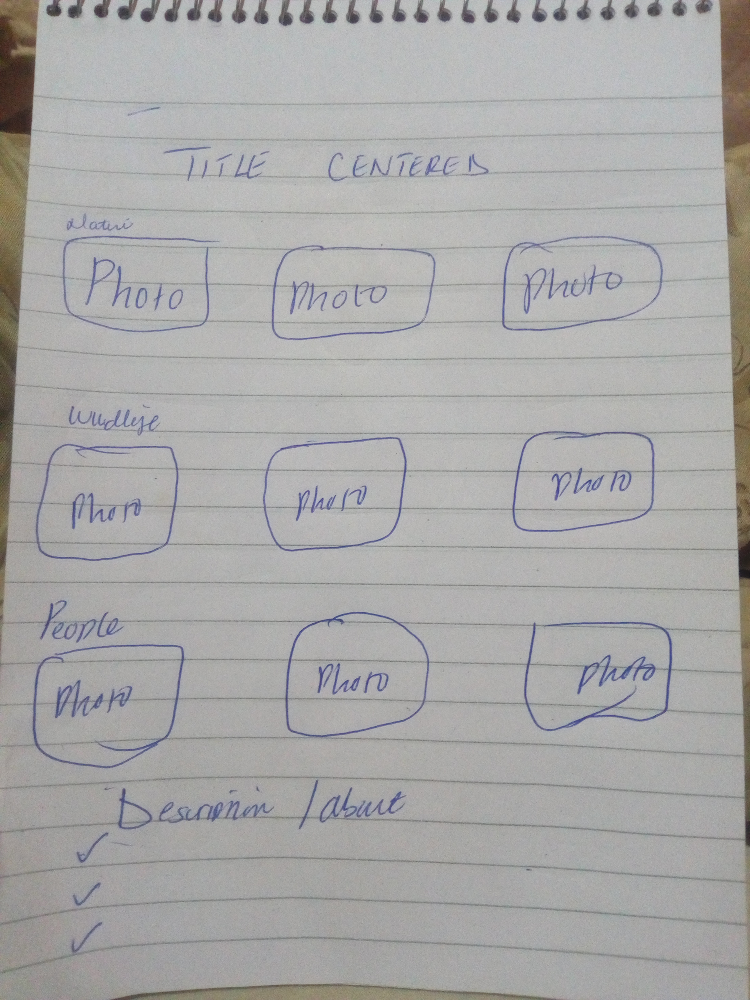

 
# Green Photography
#### Am Rodger Philip Kamau. A photographer by profession, I love nature and its wonder,
#### By **{I did this work alone,here is a draft }**
## Description
I wanted to inspire many people to take care of Nature and embrace it, I hope people get to see this website, share it and download images from it. Nature images that are used include
          * Nature
          * Seasons
          * Wildlife
## Setup/Installation Requirements
* It a free website
* No logins required
* Images can downloaded from the website
* easy-to-understand and go through it.
## Known Bugs
There are no known issues or bugs in this site. Its safe for all devices.
## Technologies Used
Exclusively html and css used applied for the production
## Support and contact details
In case you have a problem or add-ons concerning this site, you can reach me at https://github.com/Mnubi/Photography.git
### License
MIT Licences used*
Copyright (c)2021 **{GreenPhotography}**
